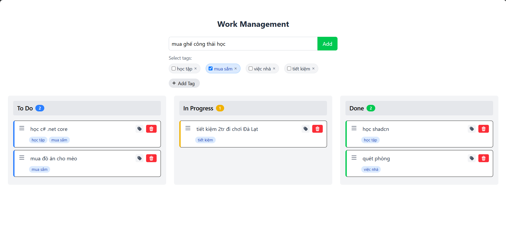

# Kanban Work Management

A sleek and responsive Kanban board application built with **React**, **TypeScript**, and **TailwindCSS**. Easily manage your workflow across three columns: **To Do**, **In Progress**, and **Done**, with intuitive drag-and-drop functionality and persistent local storage.



---

## 🔗 Live Demo

Try the application now: [View Live Demo →](kanban-work-management.vercel.app/)

---

## 🚀 Features

- 🧩 **Kanban Layout** — Organize tasks into "To Do", "In Progress", and "Done" columns
- 🎯 **Drag and Drop** — Move tasks between columns using smooth drag-and-drop interactions
- 📝 **Task Management** — Create, modify, categorize, and delete tasks
- 🏷️ **Tag System** — Create, modify custom tags, assign them to tasks
- 💾 **Persistent Storage** — Tasks and tags are saved in `localStorage`
- 📱 **Responsive Design** — Works on desktops, tablets, and smartphones
- 🔍 **Visual Feedback** — Clear indicators when dragging tasks and selecting tags

---

## 🛠️ Getting Started

### Prerequisites

- Node.js v16 or later
- npm or yarn

### Installation

1. **Clone the repository**

   ```bash
   git clone https://github.com/m0nters/Kanban-Work-Management.git
   cd kanban-work-management
   ```

2. **Install dependencies**

   ```bash
   npm install
   ```

3. **Start the development server**

   ```bash
   npm run dev
   ```

4. **Open in your browser**
   Visit [http://localhost:5173](http://localhost:5173)

---

## 📖 Usage Guide

### ✅ Creating a Task

1. Enter a task description in the input field
2. Select optional tags from the tag list
3. Click **"Add"** — the task will appear under **To Do**

### ✒️ Editing a Task

1. Double click on content of a task card
2. Write your desired content and hit enter

### 🔄 Moving Tasks

- Click and drag a task **by the handle icon** to another column or position
- Visual indicators show valid drop areas between tasks
- Drop areas adjacent to the dragged task are automatically hidden

### 🗑️ Deleting Tasks

- Click the trash icon on the task card

### 🏷️ Managing Tags

- **Create tags**: Click the "Add Tag" button to create custom tags
- **Select tags**: Click on tags to toggle selection when creating tasks
- **View tags**: See all assigned tags displayed directly on task cards with text truncation for long tags
- **Edit task tags**: Click the tag icon on any task to open the tag selector
- **Edit tag**: Double click the tag content to edit (only in full mode)
- **Toggle tags**: Click any tag in the selector to add/remove it from a task
- **Remove tags**: Click the X icon on a tag to delete it from the entire system
- **Tag display modes**: Tags appear in different modes (read-only, toggle-only, full) depending on context

---

## 🧰 Technologies Used

- **React 19** — UI framework
- **React Context API** — State management
- **TypeScript** — Static typing
- **TailwindCSS** — Utility-first styling
- **Vite** — Fast dev/build tool
- **localStorage API** — Persistent storage

---

## 📁 Project Structure

```bash
src/
  ├── components/
  │   ├── TagChip.tsx       # Tag chip component with multiple display modes
  │   ├── DropArea.tsx      # Drag and drop target areas
  │   ├── TodoCard.tsx      # Task card component
  │   └── TodoColumn.tsx    # Column wrapper
  ├── contexts/
  │   └── TodoContext.tsx   # Global state management
  ├── App.tsx               # App root
  ├── main.tsx              # App entry point
  └── styles.css            # Global styles
```

---

## 📦 Build for Production

1. **Install dependencies (if not already installed)**

   ```bash
   npm install --legacy-peer-deps
   ```

2. **Build for production**

   ```bash
   npm run build
   ```

This will create an optimized production build in the `dist/` folder. You can then deploy it to services like **Netlify**, **Vercel**, **GitHub Pages**, or any static host.

---

## 📄 License

This project is licensed under the [MIT License](LICENSE).
